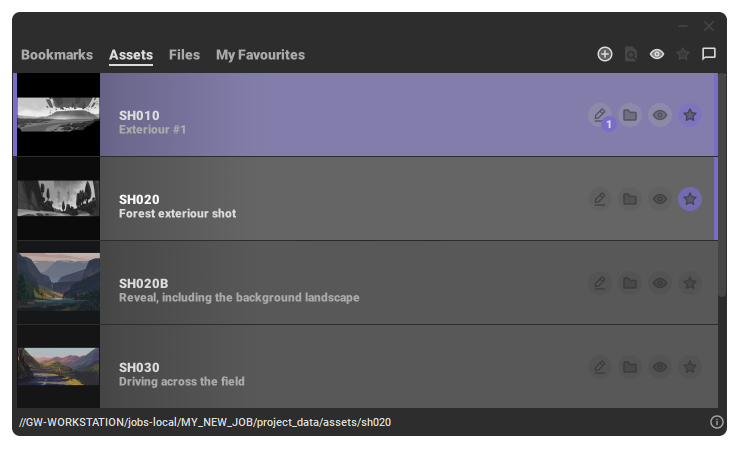

 <h1>GWBrowser</h1> 

 

    
    
    

___
## Simple digital asset manager to help small teams to organize animation and film productions.
___

Aimed at small and medium sized teams, GWBrowser was designed to help users locate images and scenes quickly by structuring data and adding descriptions, tags and thumbnails to files. Check out the ``documentation`` for more info!

 

### Key features

* Native **MacOS** & **Windows** versions
* Dedicated **Maya** plugin
* Thumbnails generated by **OpenImageIO** of most image and video formats
* MacOS-style thumbnail previews
* Screen-captures, and custom thumbnails
* Drag and drop
* Items can be saved as favourites or hidden by marking them archived
* Alembic-cache content previews
* and more...

## Credits
Gergely Wootsch, 2019.  
hello@gergely-wootsch.com  
http://gergely-wootsch.com
