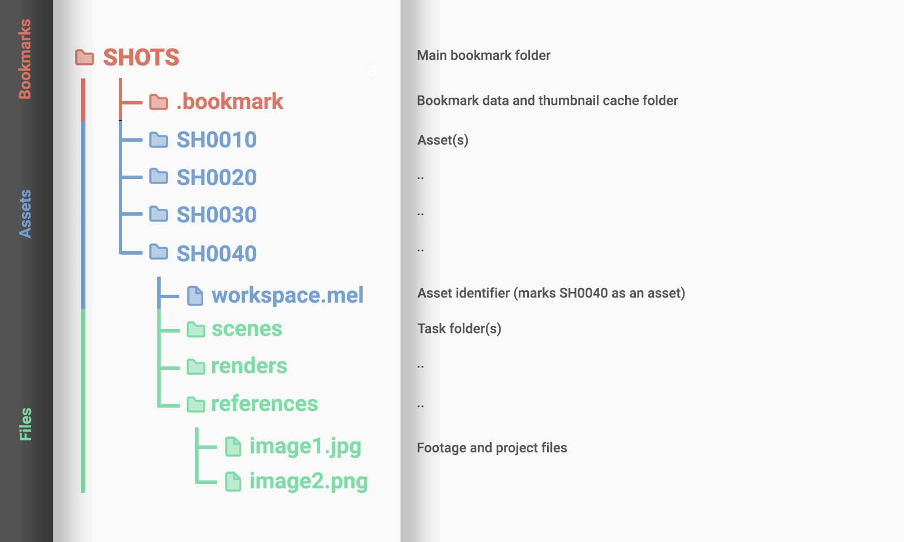

<center>
  
  <br>
  <span style="font-size:28pt;margin:0px;">Bookmarks</span>

  <p style="font-size:16pt;margin:0px;">A simple file and asset manager for animation and CG productions.</p>

  <br>

  <p>
    <a href="http://gergely-wootsch.com">
        
    </a>
    <a href="http://gergely-wootsch.com">
        
    </a>
    <a href="http://gergely-wootsch.com">
        
    </a>
  </p>

</center>


## Features

* Create jobs and assets using custom folder templates
* Annotate items using thumbnails, TODOs, tags and descriptions
* Archive superflous items without touching the underlying files
* Preview easily most image formats and Alembic archives
* Reveal files in Finder / Explorer
* Drag & Drop capable file-browser
* Push footage to **Shotgun RV** from within Bookmarks
* Send file paths and messages directly with **Slack**
* Maya plugin


<center>

  <p style="width:89%;text-align:justify;">Bookmarks gives an overview of your shots, the files inside them and any
  custom notes, thumbnails and descriptions you or your team added. You
  can use Bookmarks to create new jobs, add assets to them, or browse existing
  content.</p>

  <p style="width:89%">

  To can make your job pretty by adding thumbnails...

  </p>
  

  <br>
  <p style="width:89%">

  ...and a short descriptions.

  </p>
  

  <p style="width:89%">

  Content is organised into three main tabs, like so:

  </p>

  <table style="width:89%">
    <tr>
      <th style="text-align:justify;font-weight:100;font-size:10pt;" width="10%">
        Bookmarks
      </th>
      <th style="text-align:justify;font-weight:100;font-size:10pt;" width="90%">

  Arbitary folders inside your job folder and the main container of
  CG content.

  They have their own _**framerate**_, _**resolution**_, _**default frame range**_,
  and _**Slack Tokens**_ that DCCs can use to set up new scenes.
      </th>
    </tr>
    <tr>
      <th style="text-align:justify;font-weight:100;font-size:10pt;" width="10%">
        Assets
      </th>
      <th style="text-align:justify;font-weight:100;font-size:10pt;" width="90%">
  A container of **task folders**,
  eg. a folder with _scene_, _render_, _export_ folders. Think of them as
  Maya or Houdini like workspaces.

  You can use your own templates as the templates are plain zip archives containing folder/files.
  Any folder can be an asset, and any folder containing an "asset
  identifier" file (eg. `workspace.mel`, but this can be customised to be any file)
  will be recognised as such automatically.
      </th>
    </tr>
    <tr>
      <th style="text-align:justify;font-weight:100;font-size:10pt;" width="10%">
        Files
      </th>
      <th style="text-align:justify;font-weight:100;font-size:10pt;" width="90%">
Files are stored inside "task folders". These are the _scene_, _render_,
_export_ folders placed in the root of an asset.
When browsing, Bookmarks reads all files inside a selected task folder, including files in subdirectories.
You can use the search filters and flags to find and save footage or scenes files
you need to be working with.

``` python
  # Parsing the whole task folder does come with a performance tradeoff as all
  # files have to be loaded in advance. Up to a few hundred thousand files this
  # should not take too long, but a lot depends on network access, hard-drive
  # speeds, etc.
```
</th>
    </tr>
    <tr>
      <th colspan=2>
        
      </th>
    </tr>
  </table>
</center>


***


### Setup

`Right-Click` anywhere on the main window and select `Manage bookmarks`.<br>
Here you can configure servers, create new jobs and bookmark folders.

To add a server, click the icon by "Servers".<br>

<center>
  
</center>


```
The server is usually a location on a central network
location but can be any folder accessible to your computer, eg.
\\MY-SERVER\JOBS or C:\JOBS /volumes/server/jobs can all be valid.
```


Click  next to _Jobs_ to add new jobs.
Templates are simple zip files. To add your own just drag and drop them where
the templates are listed, or `right-click -> Add template...`

If the job template already has bookmark folders they will be listed below.
You click the name to add or remove if from Bookmarks. Otherwise, click  next to _Bookmarks_ to mark
a folder as a bookmark.


* * *

# Maya plugin

The Maya plugin replaces Maya's **_Set Project_** and uses Bookmarks' own assets
to set the current Workspace.


<!-- <p align="center">
 
</p> -->

### Credits and Acknowledgments

(c) Gergely Wootsch, 2020.<br>
[Email Me](mailto:hello@gergely-wootsch.com)<br>
[gergely-wootsch.com](http://gergely-wootsch.com)
