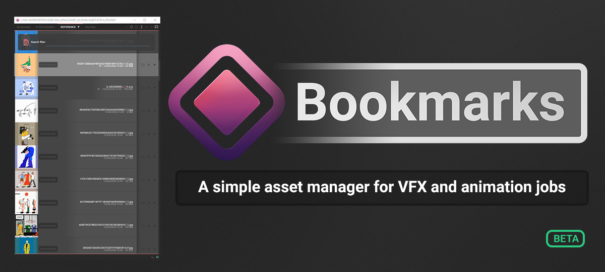

<h3>Bookmarks</h3>

 

    
    
    

***

<h3>A simple PySide2-based asset browser to help navigate folders and
files used in film and animation projects.</h3>

***

 

### Key features

* **MacOS** & **Windows** standalone versions
* **Maya** plugin & project control
* **Maya** scene and alembic exports and imports
* To-do lists and descriptions
* Job and asset folder templates
* Thumbnails **OpenImageIO** from most image and video formats
* Drag and drop
* Sort, filter files and folder using names, archived, and favourite tags
* Quick access to the file-system
* Alembic-cache content previews
* and more...

### mBookmarks

Dedicated maya plug-in

 

***
### [Download the latest binary release](https://github.com/wgergely/Bookmarks/releases)

### [Documentation](https://wgergely.github.io/Bookmarks) (Docs are work in progress!)
***

 

### Credits and acknowledgments
(c) Gergely Wootsch, 2019.  
[hello@gergely-wootsch.com](mailto:hello@gergely-wootsch.com)   
[gergely-wootsch.com](http://gergely-wootsch.com)

Huge thanks for [Glassworks Barcelona](https://www.glassworksvfx.com/) and [Studio Aka](https://studioaka.co.uk/) para todo.
